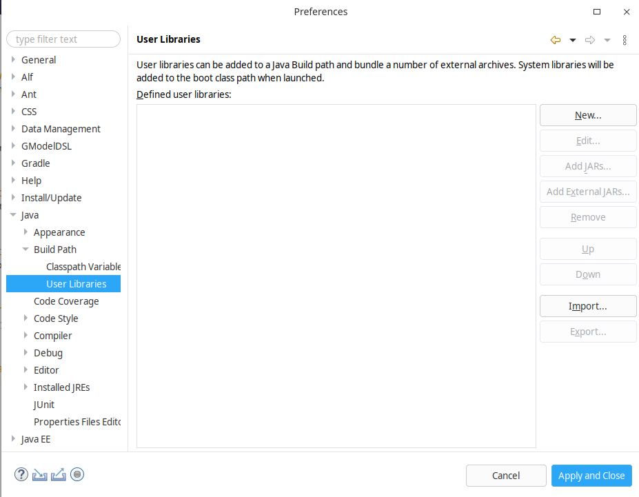
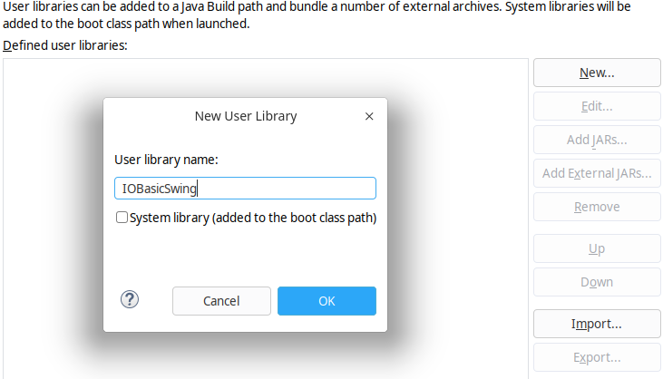
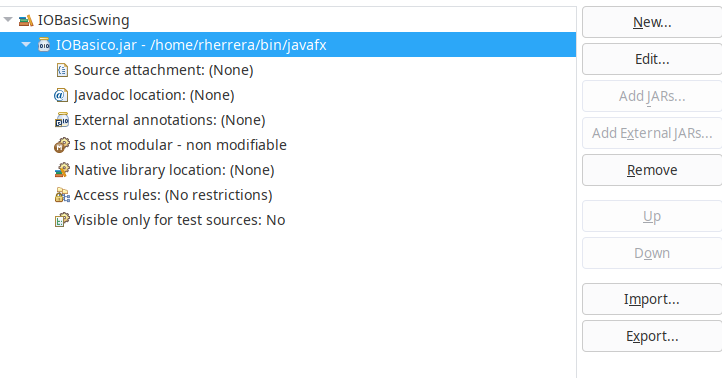
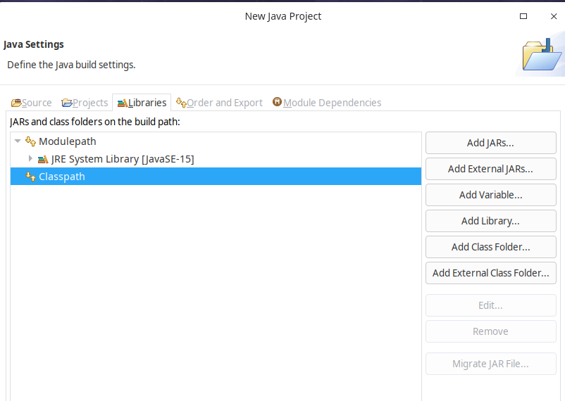
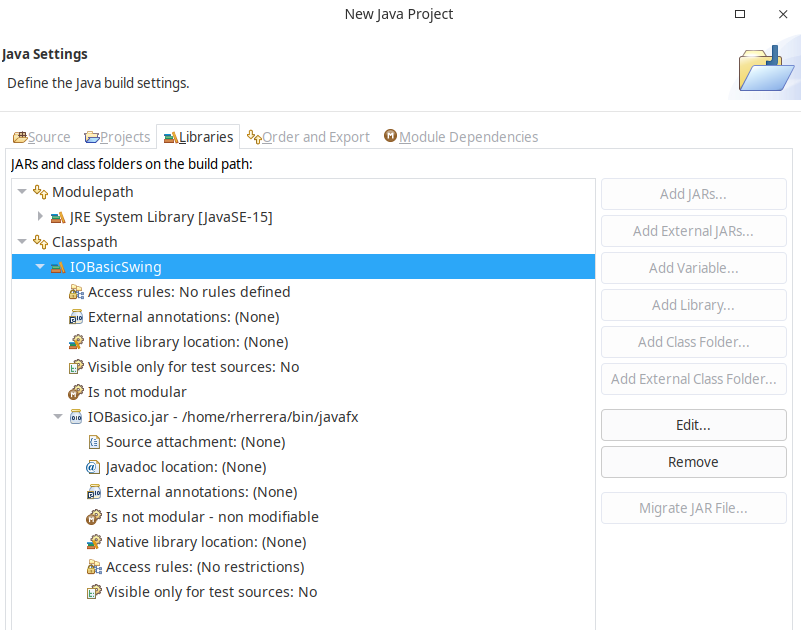
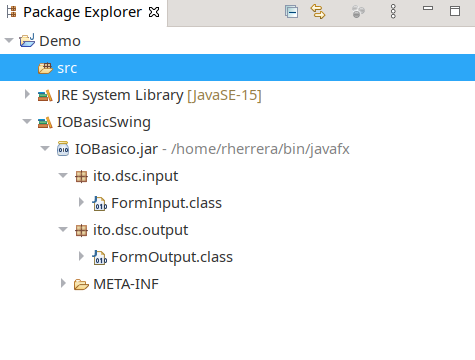

# IOBasicSwing
> **Descripción** Esta biblioteca tiene como fin realizar funciones básicas de entrada/salida (I/O) utilizando Swing (JOptionPane).Provee dos clases que se explican en este documento, así como las funcionalidades que provee para ser utilizado en aplicaciones desarrolladas en Java.
## Contenido
#### 1.- IOBasic.jar
> **Nota** Archivo para agregar a proyecto Java, en cualquier IDE de desarrollo, en el caso de eclipse, puede agregarse como biblioteca de usuario registrandolo en preferencias de Java. Revisar la pantalla siguiente que se activa cuando vamos al menu principal de eclipse y desde la opción de windows seleccionamos preferencias, se indica Java, Build Path y User libraries.
> 

>**Nota**  Seleccionar New para agregar nueva biblioteca, en el formulario proporcionar un nombre que le quieras dar, en mi caso le puse IOBasicSwing
>

>**Nota** Seleccionar Add External JARS ubicar la ruta donde se localizar el archivo IOBasic.jar seleccionarlo y mostrará lo siguiente:
>

>**Nota** Cuando se crea un proyecto Java nuevo, dirigirse a la sección de bibliotecas (Libraries) para agregar la biblioteca instalada previamente (IOBasicSwing)
> Se deberá seleccionar classpath y el boton Add Library 

>**Nota** Una vez agregada la biblioteca se observará que se despliega su contenido.
>

>**Nota** Una vez creado el proyecto se observará en el proyecto la biblioteca disponible para utilizar.
>

>**Nota** Apartir de aqui se puede comenzar a utilizar
